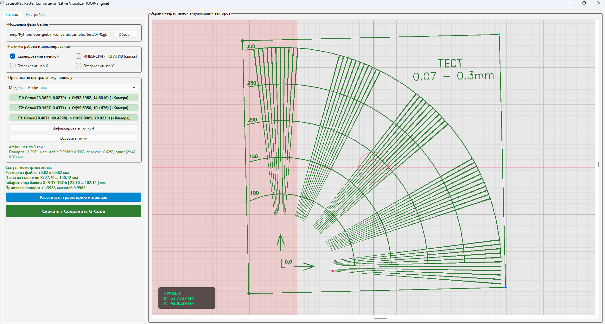
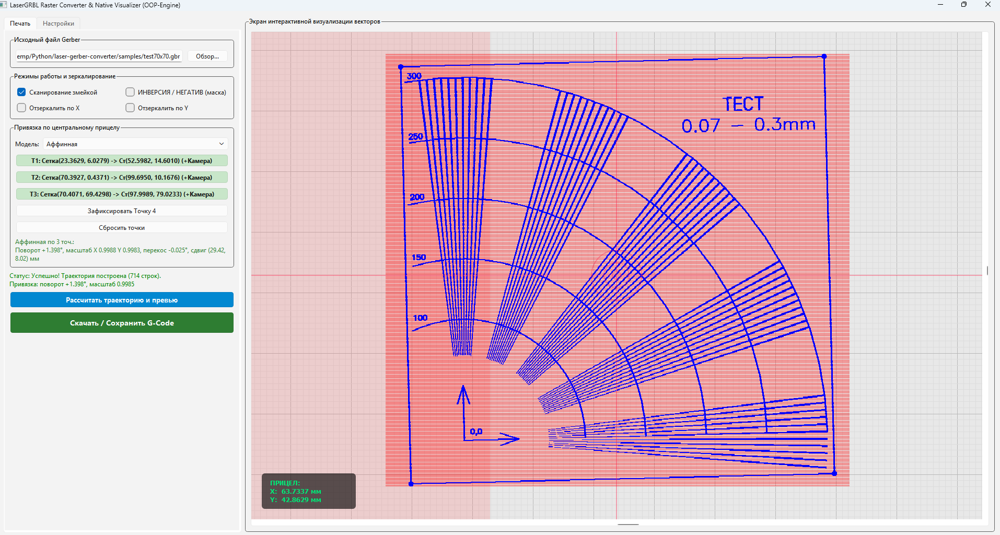

# Laser Gerber Raster Converter & Native Visualizer

Высокоточный конвертер векторных файлов **Gerber (RS-274X)** в растровый **G-Code** для лазерных граверов и ЧПУ-станков под управлением **GRBL**. 

Главная особенность программы — **профессиональная система оптического интерактивного базирования** по случайным реперам на плате (технология авиационного ИЛС / HUD). Она позволяет идеально совместить траекторию выжигания лазера с уже вытравленным текстолитом или заготовкой, даже если плата лежит на столе станка криво, смещена или имеет линейные деформации усадки.

---

## 🔥 Ключевые возможности

* **Авиационный прицел (HUD Mode):** Тонкий полупрозрачный красный визир с тремя концентрическими кольцами намертво закреплен по центру экрана. Вы перемещаете саму карту платы «рукой» и зумируете колесиком мыши строго под перекрестие, что гарантирует точность наведения пиксель в пиксель.
* **Привязка по 1–4 точкам:** реперы выбираются в любых местах платы (отверстия, площадки, углы). Модель привязки выбирается автоматически по числу точек или вручную:
  * **1 точка** — сдвиг по X и Y;
  * **2 точки** — сдвиг + поворот (текстолит не растягивается — обычно лучший выбор), по желанию + общий масштаб;
  * **3–4 точки** — аффинная модель (растяжение и перекос заготовки) методом наименьших квадратов.

  После привязки показываются поворот, масштаб, перекос и сдвиг, а если точек больше минимума — невязка (точность наведения).
* **Native Fast Matrix Engine:** Быстрый попиксельный расчет траектории лазера на базе геометрических пересечений `Shapely`.
* **Окно ввода координат станка:** координаты подставляются из буфера обмена (статус GRBL `MPos:x,y,z`, `X12.3 Y45.6`, `12.3, 45.6`), иначе — координаты прицела. Галочка «Наведено камерой» добавляет смещение камеры.
* **Рабочее поле и камера:** на превью показаны поле станка и мертвая зона камеры (часть поля, куда камеру навести нельзя из-за ее смещения относительно лазера). Если проход вместе с overscan выходит за поле — предупреждение в статусе.
* **Интерактивный визуализатор:** Показывает исходную геометрию (зеленым цветом), зафиксированные маркеры реперов, а после расчета — реальные рабочие проходы лазера (синим) и зоны разгона/торможения каретки Overscan (красным).
* **Автосохранение параметров:** все настройки (лазер, режимы, поле станка, смещение камеры, модель привязки) сохраняются в `.ini` сразу при изменении и восстанавливаются при следующем запуске. Точки привязки не сохраняются: при запуске и при загрузке нового Gerber привязка начинается заново (плата на столе каждый раз лежит по-новому).

---

## 🛠 Требования и зависимости

Для работы приложения необходим **Python 3.10+** и следующие библиотеки:

```bash
pip install PyQt6 numpy shapely gerbyx
```

* `PyQt6` — современный графический интерфейс программы.
* `numpy` — высокоточные матричные вычисления и решение систем линейных уравнений.
* `shapely` — аналитическая работа с двумерной векторной геометрией (пересечения, сдвиги, трансформации).
* `gerbyx` — парсинг исходных файлов Gerber.

---

## 🚀 Быстрый запуск

1. Перейдите в директорию с проектом и активируйте ваше виртуальное окружение (если используется).
2. Запустите главный скрипт:
   ```bash
   python main.py
   ```

---

## 📐 Инструкция по работе и калибровке платы

### Шаг 1. Загрузка файла и настройка лазера
1. Нажмите кнопку **«Обзор...»** и выберите ваш Gerber-файл (поддерживаются форматы `.gbr`, `.pho`).
2. На вкладке **«Настройки → Лазер»** задайте (приложение всегда открывается на вкладке **«Печать»**, настройки сохраняются автоматически):
   * **Режим лазера:** `M4` (динамическая мощность для растра) или `M3` (постоянная).
   * **Макс. мощность (S):** предел ШИМ вашего контроллера (например, `255` или `1000`).
   * **Скорость гравировки:** скорость рабочих проходов лазера в мм/мин.
   * **Шаг строки / Луч:** разрешение гравировки (например, `0.0500` мм или `0.1000` мм).
   * **Вылет каретки Overscan:** дистанция в мм за пределами платы для разгона и торможения каретки (исключает нагары по краям).

### Шаг 2. Станок и камера
На вкладке **«Настройки → Станок и камера»** задайте рабочее поле станка и смещение камеры **«Лазер -> Камера»** — положение камеры относительно лазера в мм (может быть отрицательным).

Без привязки плата прижата к нулю станка (рабочему нулю, который вы выставляете сами). Смещение камеры рисунок не сдвигает — оно учитывается только у точек привязки, наведенных камерой.

### Шаг 3. Привязка платы по реперам
1. Привязка всегда доступна на вкладке **«Печать»**: в центре экрана — полупрозрачный красный прицел.
2. Выберите модель (по умолчанию **«Авто»**: 1 точка — сдвиг, 2 — сдвиг + поворот, 3 и больше — аффинная).
3. Наведите на репер камеру (или лазер) станка. В программе перетащите рисунок мышью так, чтобы тот же репер оказался в перекрестии прицела, приблизьте колесом для точности.
4. Нажмите **«Зафиксировать Точку 1»** и введите показания станка (DRO) — или они подставятся из буфера обмена. Если наводили камерой, оставьте галочку **«Наведено камерой»**; если лазером — снимите ее (выбор запоминается для следующей точки). Нажмите **OK**.
5. Привязка пересчитывается после каждой точки. Для поворота нужно минимум 2 точки, разнесенные как можно дальше.
   * Реперы в мертвой зоне камеры (розовая полоса) наводите лазером.
   * Если точек больше минимума модели, показывается невязка — по ней видно, насколько точно наведены точки.
6. Под прицелом остается та же точка платы, рисунок переходит в координаты станка. Цветные отметки должны лечь на реперы. **«Сбросить точки»** — начать заново.

### Шаг 4. Расчет и сохранение G-кода
1. Нажмите синюю кнопку **«Рассчитать траекторию и превью»**.
2. Дождитесь оптимизации слоев. На экране отобразятся синие траектории жжения.
3. Нажмите зеленую кнопку **«Скачать / Сохранить G-Code»**, выберите место сохранения и запишите финальный файл `.gcode` (или `.nc`).
4. Загрузите файл в LaserGRBL / Candle и запускайте выжигание!

---

## 🧭 Проверка без станка (режим `--test`)

```bash
python main.py --test
python main.py --test --seed 42
```

Рядом с основным окном открывается окно **«Станок (симуляция)»**. Загруженная плата кладется на виртуальный стол в **скрытое** положение: случайный сдвиг, поворот, небольшая усадка, при необходимости — зеркально (нижний слой). Основное окно этого положения не знает и узнает его только через калибровку — как на настоящем станке. `--seed` задает номер укладки для повторяемой проверки.

* **ЛКМ** — навести камеру или лазер (голова станка едет следом и упирается в край поля), **стрелки** — шаг головы 0.1 мм (Shift — 1 мм, Ctrl — 0.01 мм), **колесо** — зум, **ПКМ** — сдвиг вида.
* Розовым показана **мертвая зона камеры**: часть поля, куда камеру навести нельзя из-за ее смещения относительно лазера. Если камера не достает до точки, симулятор предупреждает красным. Такие реперы наводите лазером: переключатель **«ЛКМ наводит: лазер (указатель)»**.
* В окне ввода координат станка DRO подставляется из симулятора, галочка «Учитывать смещение камеры» ставится по тому, чем наведено (камерой или лазером).
* После «Рассчитать траекторию» G-код «прожигается» на виртуальном столе поверх настоящего положения платы: видно, легли ли линии на медь, и выводятся цифры — промах, покрытие, выход за поле станка, наличие `G0`.

Размер поля, смещение камеры, максимальный поворот платы и зеркальность задаются в окне симулятора.

---

## 🗂 Структура проекта

```
main.py              — точка входа (запуск окна)
core/                — расчеты без интерфейса (не зависят от Qt)
  gerber.py          — загрузка Gerber в геометрию shapely (мм)
  geometry.py        — трансформации платы и растровое сканирование
  calibration.py     — привязка по реперным точкам: сдвиг, сдвиг + поворот, масштаб, аффинная (МНК)
  machine.py         — рабочее поле станка, мертвая зона камеры
  coords.py          — разбор координат станка из буфера обмена
  gcode.py           — генерация растрового G-кода
  simulator.py       — виртуальный станок для проверки без железа
ui/                  — интерфейс PyQt6
  main_window.py     — главное окно
  view.py            — сетка, зум и HUD-прицел
  qt_paths.py        — геометрия и траектории -> пути Qt
  simulator_window.py — окно виртуального станка (режим --test)
samples/             — примеры Gerber-файлов
tests/               — тесты pytest
docs/images/         — скриншоты
```

## 🧪 Тесты

```bash
pip install -r requirements-dev.txt
python -m pytest
```

Проверка стиля и типичных ошибок — [ruff](https://docs.astral.sh/ruff/) (настройки в `pyproject.toml`):

```bash
python -m ruff check .
python -m ruff format .
```

Тест `tests/test_gcode.py::test_gcode_matches_golden` сверяет G-код для файлов из `samples/` с эталонными хешами в `tests/data/golden_gcode.json`. Если формат G-кода меняется намеренно, эталон нужно перегенерировать.

---

## 📂 Структура конфигурации
Приложение сохраняет пользовательские настройки в домашней директории пользователя в файле:
`~/.LaserConverterApp.ini` (в Linux/macOS) или в реестре/папке пользователя (в Windows). Это позволяет не настраивать параметры мощности и шага луча заново при каждом запуске.

## 📝 Лицензия

Проект распространяется под лицензией MIT. Вы можете свободно использовать и модифицировать данный код.

<details>
  <summary>📷 Посмотреть скриншот</summary>

  
  

</details>
